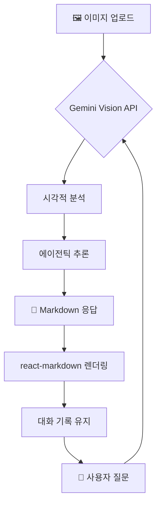

# 🔮 Gemini Agentic Vision

### *Visual Intelligence Meets Agentic Reasoning*

**Gemini AI의 멀티모달 시각 능력과 에이전틱 추론을 결합한 React 기반 인터랙티브 분석 워크스테이션**

[](https://github.com/Reasonofmoon/gemini-agentic-vision)
[](https://react.dev)
[](https://vitejs.dev)
[](https://ai.google.dev)
[](https://www.typescriptlang.org)

> **"이미지 하나로 무엇을 알 수 있을까?"**  
> Gemini의 시각 분석 + 멀티턴 에이전틱 대화로 이미지 속 숨겨진 인사이트를 추출합니다.

[🚀 AI Studio 원본](https://ai.studio/apps/bundled/gemini_visual_thinking) · [🐛 이슈 리포트](../../issues)

---

## 🧠 Philosophy — "왜 만들었는가"

기존 AI 이미지 분석 도구의 한계:

| 기준 | 기존 채팅 방식 | Gemini Agentic Vision |
|------|--------------|----------------------|
| 대화 맥락 | 이미지 1장 + 1회 질문 | **멀티턴 + 이미지 기억 유지** |
| 응답 형식 | 평문 텍스트 | **Markdown 렌더링 + 구조화** |
| UX | 빈 채팅창 | **Framer Motion 애니메이션** |
| 확장성 | 단일 모델 | **@google/genai SDK 직접 연동** |



---

## ⚙️ 시스템 아키텍처

### Layer 1 · Vision Core
- **@google/genai v1.32** — Gemini Flash 멀티모달 API
- 이미지 + 텍스트 동시 처리, Base64 인코딩 파이프라인

### Layer 2 · Conversation Engine
- **React 19** + `useReducer` 기반 멀티턴 상태 관리
- 대화 히스토리 자동 컨텍스트 주입

### Layer 3 · UI/Motion Layer
- **Framer Motion** — 메시지 등장 애니메이션
- **lucide-react** — 아이콘 시스템
- **react-markdown + remark-gfm** — 풍부한 응답 렌더링

> **Wow Moment**: 이미지 드롭 후 **3초** 안에 Gemini의 시각 분석 스트리밍 시작

---

## 🚀 빠른 시작

```bash
# 1. 의존성 설치
npm install

# 2. Gemini API 키 설정
cp .env.example .env.local
# .env.local 열고 GEMINI_API_KEY=발급받은키 입력

# 3. 개발 서버 실행
npm run dev
# → http://localhost:5173
```

> API 키 발급: [Google AI Studio](https://aistudio.google.com/app/apikey)

---

## 🎯 수준별 활용 가이드

### 🟢 Starter — "30초 첫 분석"
1. `npm run dev` 실행
2. 이미지 파일 드래그 앤 드롭
3. "이 이미지에서 무엇이 보이나요?" 전송

### 🔵 Professional — "심층 분석"
1. 이미지 업로드 후 구체적 질문 (예: "이 데이터 차트의 트렌드를 분석해줘")
2. 후속 질문으로 세부 항목 파고들기
3. Markdown 응답을 복사하여 문서화

### 🟣 Enterprise — "AI Studio 연동"
1. `vite build`로 프로덕션 번들 생성
2. Google AI Studio 앱으로 배포
3. 커스텀 프롬프트 시스템으로 도메인 특화

---

## 🔧 확장 가이드

| 우선순위 | 방법 | 난이도 | 효과 |
|----------|------|--------|------|
| **1st** | `.env.local` API 키 교체 | ⭐ | 다른 Gemini 모델 연동 |
| **2nd** | `services/gemini.ts` 수정 | ⭐⭐ | 프롬프트 커스터마이징 |
| **3rd** | 컴포넌트 확장 | ⭐⭐⭐ | 기능 모듈 추가 |

---

## 🛠️ 기술 스택

| 레이어 | 기술 | 버전 |
|--------|------|------|
| AI | Google Gemini API | 1.32 |
| UI Framework | React | 19.2 |
| Build Tool | Vite | 6.2 |
| 언어 | TypeScript | 5.8 |
| 애니메이션 | Framer Motion | 12.x |
| 아이콘 | lucide-react | 0.559 |
| Markdown | react-markdown | 10.x |

---

## 🌐 다국어 지원

| 항목 | 현황 |
|------|------|
| UI 언어 | 한국어 / English |
| 분석 응답 | Gemini 모델 설정 언어 준수 |
| 입력 | 언어 제한 없음 |

---

## 📋 License

MIT © [Reasonofmoon](https://github.com/Reasonofmoon)
